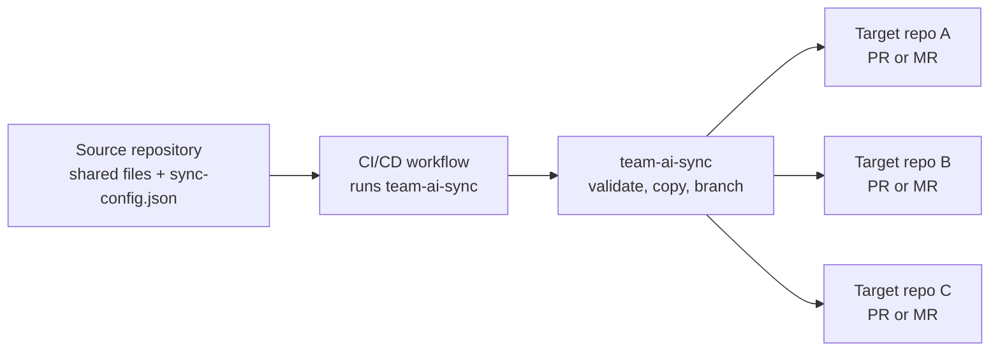

# team-ai-sync

[](https://github.com/paladini/team-ai-sync/actions/workflows/ci.yml)
[](https://github.com/marketplace/actions/team-ai-sync)
[](https://hub.docker.com/r/paladini/team-ai-sync)
[](LICENSE)

Sync shared AI guidance files from one source repository to many target
repositories through reviewable pull requests or merge requests.

`team-ai-sync` helps engineering teams keep files such as `AGENTS.md`,
`CLAUDE.md`, prompt templates, editor settings, and repository conventions
aligned across many codebases without copying them by hand.

It is available as a GitHub Action, a GitLab CI/CD Component, and a Bitbucket
Pipe. Each package is designed for repositories hosted on that same platform.

**Project site:** [paladini.github.io/team-ai-sync](https://paladini.github.io/team-ai-sync/)

**Documentation:** [docs/README.md](docs/README.md)

**Docker image:** [paladini/team-ai-sync](https://hub.docker.com/r/paladini/team-ai-sync)

## Why teams use it

AI-assisted development works better when every repository has current, shared
guidance. The problem is keeping that guidance updated across dozens or
hundreds of repositories.

Use `team-ai-sync` when you want one source of truth for files such as:

- `AGENTS.md`
- `CLAUDE.md`
- `.github/copilot-instructions.md`
- `.github/instructions/**`
- `.github/prompts/**`
- `.cursor/rules/**`
- `.vscode/extensions.json`
- `.editorconfig`
- shared prompts, agent rules, code review guidance, and repository conventions

Instead of writing directly to target default branches, `team-ai-sync` creates
or updates review requests. Target repository owners keep control of review and
merge.

## How it works



In practice:

1. Put shared files in one source repository.
2. Add `sync-config.json` with target repositories and paths to sync.
3. Run `team-ai-sync` from CI/CD.
4. Review and merge the generated PRs or MRs in each target repository.

## Choose your platform

Use the package that matches where your repositories live. Cross-platform sync
is not the supported operating model.

| Platform | Package | Creates |
| --- | --- | --- |
| GitHub | [GitHub Action](https://github.com/marketplace/actions/team-ai-sync) | Pull requests |
| GitLab | [GitLab CI/CD Component](https://gitlab.com/explore/catalog/paladini/team-ai-sync) | Merge requests |
| Bitbucket | `paladini/team-ai-sync:1.0.0` Bitbucket Pipe | Pull requests |
| Docker | [paladini/team-ai-sync](https://hub.docker.com/r/paladini/team-ai-sync) | Runtime for GitLab and Bitbucket wrappers |

## Quick start for GitHub Actions

Create `.github/workflows/sync-ai-assets.yml` in the source repository:

```yaml
name: Sync AI Assets

on:
  push:
    branches: [main]
  workflow_dispatch:

jobs:
  sync:
    runs-on: ubuntu-latest
    permissions:
      contents: read
    steps:
      - uses: actions/checkout@v4
      - uses: paladini/team-ai-sync@v1
        with:
          github-token: ${{ secrets.TEAM_SYNC_ADMIN_PAT }}
          config-path: sync-config.json
```

Then create `sync-config.json` in the source repository:

```json
{
  "targetRepositories": [
    "your-org/api-service",
    "your-org/web-app"
  ],
  "syncMode": "overwrite",
  "deleteOrphans": false,
  "files": ["AGENTS.md", "CLAUDE.md", ".editorconfig"],
  "directories": [".github/instructions", ".github/prompts"],
  "exclude": [],
  "prOptions": {
    "title": "chore: sync team AI assets",
    "body": "Synced from {{sourceRepo}} at {{sourceCommit}}.",
    "commitMessage": "chore(ai-assets): sync team assets",
    "branch": "chore/team-ai-sync",
    "labels": ["automation", "chore"],
    "userReviewers": [],
    "teamReviewers": []
  }
}
```

Create a repository secret named `TEAM_SYNC_ADMIN_PAT` with permission to read
and write the target repositories. For the full setup, including GitLab and
Bitbucket, read the [getting started guide](docs/getting-started.md).

## Try a dry run first

Use `dry-run: true` to validate configuration and detect changes without
pushing branches or creating pull requests.

```yaml
- uses: paladini/team-ai-sync@v1
  with:
    github-token: ${{ secrets.TEAM_SYNC_ADMIN_PAT }}
    config-path: sync-config.json
    dry-run: true
```

The dry run clones targets into temporary worktrees, copies configured files,
and reports whether changes exist.

## GitLab and Bitbucket

### GitLab CI/CD Component

Add this to `.gitlab-ci.yml` in the source project:

```yaml
include:
  - component: gitlab.com/paladini/team-ai-sync/team-ai-sync@1.0.0
    inputs:
      config-path: sync-config.json
```

The component reads `GITLAB_TOKEN` by default. Store a GitLab token with target
project write access as a masked CI/CD variable.

### Bitbucket Pipe

Add this to `bitbucket-pipelines.yml` in the source repository:

```yaml
pipelines:
  default:
    - step:
        name: Sync AI Assets
        script:
          - pipe: paladini/team-ai-sync:1.0.0
            variables:
              BITBUCKET_USERNAME: $BITBUCKET_USERNAME
              BITBUCKET_TOKEN: $BITBUCKET_TOKEN
              CONFIG_PATH: 'sync-config.json'
```

Store `BITBUCKET_USERNAME` and `BITBUCKET_TOKEN` as repository or workspace
variables.

## Configuration

`sync-config.json` controls the target repositories, files, directories,
exclusions, branch name, commit message, labels, and reviewers.

| Field | Description |
| --- | --- |
| `targetRepositories` | Repositories or projects that receive PRs or MRs. |
| `syncMode` | `overwrite` replaces configured paths; `skip` only copies missing files. |
| `deleteOrphans` | Removes files inside synced directories that no longer exist in source when set to `true`. |
| `files` | Individual files to sync. |
| `directories` | Directories to sync recursively. |
| `exclude` | Paths or glob patterns to skip. |
| `prOptions` | Title, body, branch, labels, reviewers, and commit message for generated review requests. |

Read the [configuration reference](docs/configuration.md) for every field,
default, and platform note.

## GitHub Action inputs

| Input | Required | Default | Description |
| --- | --- | --- | --- |
| `github-token` | yes | | PAT or GitHub App token with access to target repositories. |
| `config-path` | no | `sync-config.json` | Path to the config file in the source repository. |
| `source-root` | no | `${{ github.workspace }}` | Root containing the files and directories to sync. |
| `dry-run` | no | `false` | Validates and simulates sync without pushing branches or creating PRs. |

## Outputs

| Output | Description |
| --- | --- |
| `pr-urls` | JSON array of created or updated pull request URLs. |
| `synced-targets` | JSON array of target repositories processed successfully. |
| `failed-targets` | JSON array of failed target repositories with error messages. |
| `changed` | `true` when at least one target repository had changes. |

## Public demo

The public demo shows the full lifecycle: dry run, PR creation, PR update,
merge, and a final no-change run with `changed=false`.

- [team-ai-sync-demo-source](https://github.com/paladini/team-ai-sync-demo-source)
  stores the shared files, workflow, and `sync-config.json`.
- [team-ai-sync-demo-api](https://github.com/paladini/team-ai-sync-demo-api)
  receives a generated sync pull request.
- [team-ai-sync-demo-web](https://github.com/paladini/team-ai-sync-demo-web)
  receives the same shared guidance.

Read the [public demo walkthrough](docs/demo.md) or open the
[example setup](examples/README.md).

## Security model

`team-ai-sync` is designed for reviewable repository operations:

- It opens PRs or MRs instead of changing target default branches directly.
- It does not merge generated review requests.
- It validates paths and rejects absolute paths, `..`, and `.git`.
- It limits deletion to configured synced directories when `deleteOrphans` is
  enabled.
- It uses force-with-lease when updating existing sync branches.

Read the [security model](docs/security.md) before rolling out to a large
repository fleet.

## Documentation

- [Getting started](docs/getting-started.md)
- [Configuration reference](docs/configuration.md)
- [Authentication and permissions](docs/authentication.md)
- [Operations guide](docs/operations.md)
- [Platform packages](docs/platforms.md)
- [Security model](docs/security.md)
- [Public demo walkthrough](docs/demo.md)
- [Troubleshooting](docs/troubleshooting.md)

## Development

```bash
npm ci
npm run lint
npm test
npm run build
```

`dist/` is committed because JavaScript GitHub Actions execute bundled code
from the repository. The GitLab component and Bitbucket pipe run the packaged
OCI image.

## Releases

Use the stable `v1` tag in production workflows:

```yaml
- uses: paladini/team-ai-sync@v1
```

See [CHANGELOG.md](CHANGELOG.md) for release notes.

## About

`team-ai-sync` was created by
[Fernando Paladini](https://github.com/paladini), with love, for the
[Tech Leads Club](https://techleads.club/) community.

It is meant to help technical leaders and their teams keep AI collaboration
files, repository guidance, and shared development conventions aligned across
many codebases without turning that maintenance into manual work.

## License

[MIT](LICENSE)
