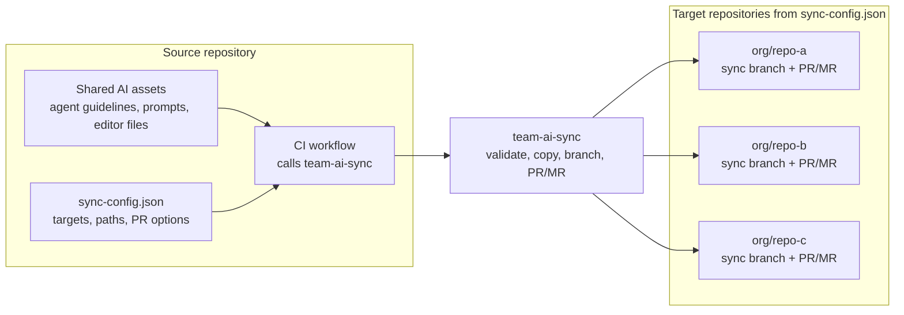

# team-ai-sync

`team-ai-sync` is a CI/CD automation tool for syncing team AI assets, prompt files, editor settings, and shared development files from one source repository to multiple target repositories through pull requests or merge requests.

It is available as a GitHub Action, a GitLab CI/CD Component, and a Bitbucket Pipe. Each platform package is designed for repositories hosted on that same platform.

Use it when your team wants one repository to be the source of truth for files such as:

- `AGENTS.md`
- `CLAUDE.md`
- `.github/copilot-instructions.md`
- `.github/instructions/**`
- `.github/prompts/**`
- `.cursor/rules/**`
- `.vscode/extensions.json`
- `.editorconfig`
- shared prompts, agent instructions, code review guidelines, and repository conventions

## How it works

You keep the shared assets and `sync-config.json` in one source repository. A workflow in that repository calls `team-ai-sync`. The tool reads the config, checks each target repository, copies the configured files into a sync branch, and opens or updates pull requests or merge requests for the destination teams to review.



In practice:

1. Update shared assets in the source repository.
2. Add target repositories and sync rules to `sync-config.json`.
3. Run the workflow manually or on push.
4. Review and merge the generated PRs or MRs in each target repository.

## GitHub live demo

See the public demo repositories for a complete, real-world run:

- [team-ai-sync-demo-source](https://github.com/paladini/team-ai-sync-demo-source):
  the source of truth with shared AI guidance, prompts, config, and workflow.
- [team-ai-sync-demo-api](https://github.com/paladini/team-ai-sync-demo-api):
  a target repository that receives a generated sync pull request.
- [team-ai-sync-demo-web](https://github.com/paladini/team-ai-sync-demo-web):
  another target repository that receives the same shared guidance.

The demo shows a dry run, pull request creation, pull request update, merge, and
a final no-change run. See [examples/README.md](examples/README.md) for the
walkthrough and evidence links.

## Documentation

Start with the [documentation index](docs/README.md), or jump directly to:

- [Getting started](docs/getting-started.md)
- [Configuration reference](docs/configuration.md)
- [Authentication and permissions](docs/authentication.md)
- [Operations guide](docs/operations.md)
- [Platform packages](docs/platforms.md)
- [Security model](docs/security.md)
- [Public demo walkthrough](docs/demo.md)
- [Troubleshooting](docs/troubleshooting.md)

## Usage

### GitHub Actions

Create a workflow in the source repository:

```yaml
name: Sync AI Assets

on:
  push:
    branches: [main]
  workflow_dispatch:

jobs:
  sync:
    runs-on: ubuntu-latest
    steps:
      - uses: actions/checkout@v4
      - uses: paladini/team-ai-sync@v1
        with:
          github-token: ${{ secrets.TEAM_SYNC_ADMIN_PAT }}
          config-path: sync-config.json
```

The token must be a PAT or GitHub App token with permission to clone, push branches, and create pull requests in the target repositories.

For production use, pin to the stable `paladini/team-ai-sync@v1` tag.

### GitLab CI/CD Component

Include the component from a GitLab source project:

```yaml
include:
  - component: gitlab.com/paladini/team-ai-sync/team-ai-sync@1.0.0
    inputs:
      config-path: sync-config.json
```

Store a GitLab token with target project write access in the source project as
`GITLAB_TOKEN`, or pass a different variable name with `token-variable-name`.

### Bitbucket Pipe

Call the pipe from `bitbucket-pipelines.yml`:

```yaml
pipelines:
  default:
    - step:
        name: Sync AI Assets
        script:
          - pipe: paladini/team-ai-sync:1.0.0
            variables:
              BITBUCKET_USERNAME: $BITBUCKET_USERNAME
              BITBUCKET_TOKEN: $BITBUCKET_TOKEN
              CONFIG_PATH: 'sync-config.json'
```

Set `BITBUCKET_USERNAME` to your Bitbucket username. `BITBUCKET_TOKEN` must be a Bitbucket API token with repository read/write and pull request access.

## GitHub Action inputs

| Input | Required | Default | Description |
| --- | --- | --- | --- |
| `github-token` | yes | | PAT or GitHub App token with access to target repositories. |
| `config-path` | no | `sync-config.json` | Path to the config file in the source repository. |
| `source-root` | no | `${{ github.workspace }}` | Root containing the files and directories to sync. |
| `dry-run` | no | `false` | Validates and simulates sync without pushing branches or creating PRs. |

## Outputs

| Output | Description |
| --- | --- |
| `pr-urls` | JSON array of created or updated pull request URLs. |
| `synced-targets` | JSON array of target repositories processed successfully. |
| `failed-targets` | JSON array of failed target repositories with error messages. |
| `changed` | `true` when at least one target repository had changes. |

## `sync-config.json`

```json
{
  "targetRepositories": ["org/repo-a"],
  "syncMode": "overwrite",
  "deleteOrphans": false,
  "files": [".editorconfig"],
  "directories": [".github/instructions"],
  "exclude": [".github/instructions/legacy-prompts.md"],
  "prOptions": {
    "title": "chore: sync team AI assets",
    "body": "Synced from {{sourceRepo}} at {{sourceCommit}}.",
    "commitMessage": "chore(ai-assets): sync team assets",
    "branch": "chore/team-ai-sync",
    "labels": ["automation", "chore"],
    "userReviewers": [],
    "teamReviewers": []
  }
}
```

### Fields

- `targetRepositories`: repositories to receive pull requests or merge requests. Use `owner/repo` on GitHub and Bitbucket, or `group/project` and `group/subgroup/project` on GitLab.
- `syncMode`: `overwrite` replaces configured paths; `skip` only copies missing files.
- `deleteOrphans`: when `true`, removes files inside synced directories that no longer exist in source.
- `files`: individual files to sync.
- `directories`: directories to sync recursively.
- `exclude`: paths or glob patterns to skip.
- `prOptions`: title, body, commit message, branch, labels, reviewers, and team reviewers for generated PRs or MRs. Platform support for labels and reviewers varies.

`{{sourceRepo}}` and `{{sourceCommit}}` are replaced in `prOptions.body`.

## Safety

All configured paths must be repository-relative. The action rejects absolute paths, `..` traversal, and `.git` paths before processing targets.

## Development

```bash
npm ci
npm run lint
npm test
npm run build
```

`dist/` is committed because JavaScript GitHub Actions execute bundled code from the repository. The GitLab component and Bitbucket pipe run the packaged OCI image.

## Releases

See [CHANGELOG.md](CHANGELOG.md) for release notes.

## About

`team-ai-sync` was created by [Fernando Paladini](https://github.com/paladini), with love, for the *TLC community*, the [Tech Leads Club](https://techleads.club/).

It is meant to help technical leaders and their teams keep AI collaboration files, repository guidance, and shared development conventions aligned across many codebases without turning that maintenance into manual busywork.
