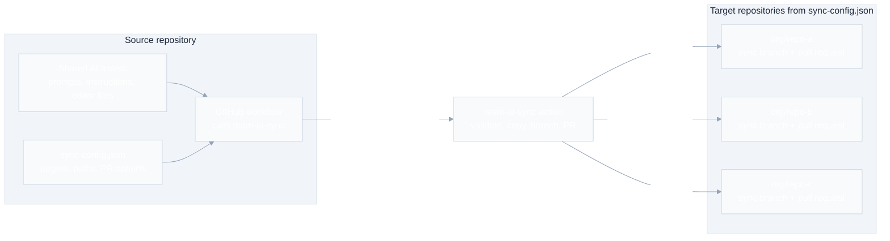

# team-ai-sync

`team-ai-sync` is a public GitHub Action for syncing team AI assets, prompt files, editor settings, and shared development files from one source repository to multiple target repositories through pull requests.

Use it when your team wants one repository to be the source of truth for files such as:

- `.github/copilot-instructions.md`
- `.github/instructions/**`
- `.vscode/extensions.json`
- `.editorconfig`
- shared prompt or agent instruction files

## How it works

You keep the shared assets and `sync-config.json` in one source repository. A workflow in that repository calls `team-ai-sync`. The action reads the config, checks each target repository, copies the configured files into a sync branch, and opens or updates pull requests for the destination teams to review.



In practice:

1. Update shared assets in the source repository.
2. Add target repositories and sync rules to `sync-config.json`.
3. Run the workflow manually or on push.
4. Review and merge the generated PRs in each target repository.

## Usage

Create a workflow in the source repository:

```yaml
name: Sync AI Assets

on:
  push:
    branches: [main]
  workflow_dispatch:

jobs:
  sync:
    runs-on: ubuntu-latest
    steps:
      - uses: actions/checkout@v4
      - uses: paladini/team-ai-sync@v1
        with:
          github-token: ${{ secrets.TEAM_SYNC_ADMIN_PAT }}
          config-path: sync-config.json
```

The token must be a PAT or GitHub App token with permission to clone, push branches, and create pull requests in the target repositories.

For early testing before a `v1` tag is published, pin to a commit SHA or to `paladini/team-ai-sync@main`.

## Inputs

| Input | Required | Default | Description |
| --- | --- | --- | --- |
| `github-token` | yes | | PAT or GitHub App token with access to target repositories. |
| `config-path` | no | `sync-config.json` | Path to the config file in the source repository. |
| `source-root` | no | `${{ github.workspace }}` | Root containing the files and directories to sync. |
| `dry-run` | no | `false` | Validates and simulates sync without pushing branches or creating PRs. |

## Outputs

| Output | Description |
| --- | --- |
| `pr-urls` | JSON array of created or updated pull request URLs. |
| `synced-targets` | JSON array of target repositories processed successfully. |
| `failed-targets` | JSON array of failed target repositories with error messages. |
| `changed` | `true` when at least one target repository had changes. |

## `sync-config.json`

```json
{
  "targetRepositories": ["org/repo-a"],
  "syncMode": "overwrite",
  "deleteOrphans": false,
  "files": [".editorconfig"],
  "directories": [".github/instructions"],
  "exclude": [".github/instructions/legacy-prompts.md"],
  "prOptions": {
    "title": "chore: sync team AI assets",
    "body": "Synced from {{sourceRepo}} at {{sourceCommit}}.",
    "commitMessage": "chore(ai-assets): sync team assets",
    "branch": "chore/team-ai-sync",
    "labels": ["automation", "chore"],
    "userReviewers": [],
    "teamReviewers": []
  }
}
```

### Fields

- `targetRepositories`: repositories to receive pull requests, in `owner/repo` format.
- `syncMode`: `overwrite` replaces configured paths; `skip` only copies missing files.
- `deleteOrphans`: when `true`, removes files inside synced directories that no longer exist in source.
- `files`: individual files to sync.
- `directories`: directories to sync recursively.
- `exclude`: paths or glob patterns to skip.
- `prOptions`: title, body, commit message, branch, labels, reviewers, and team reviewers for generated PRs.

`{{sourceRepo}}` and `{{sourceCommit}}` are replaced in `prOptions.body`.

## Safety

All configured paths must be repository-relative. The action rejects absolute paths, `..` traversal, and `.git` paths before processing targets.

## Development

```bash
npm ci
npm run lint
npm test
npm run build
```

`dist/` is committed because JavaScript GitHub Actions execute bundled code from the repository.
